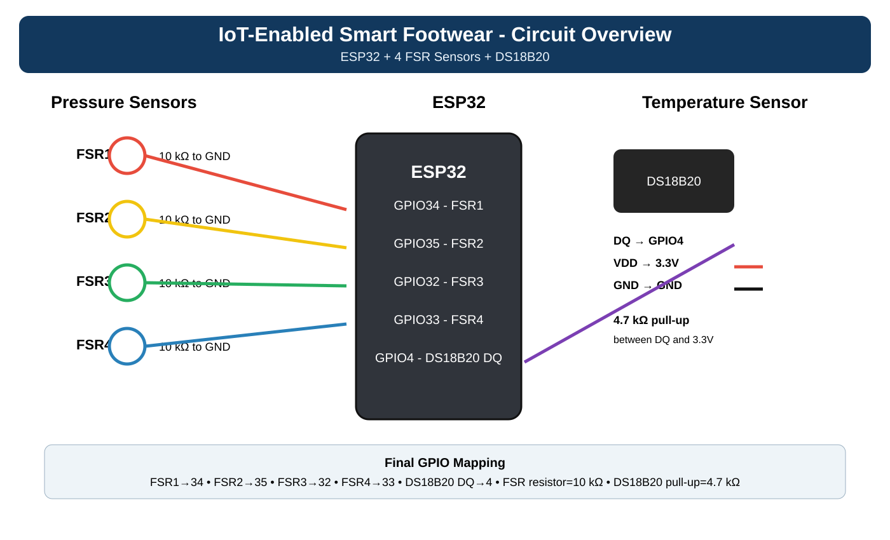
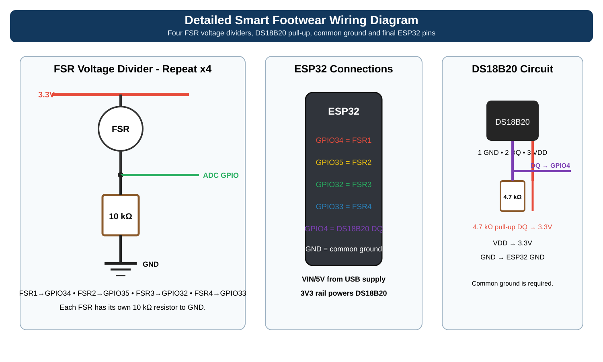
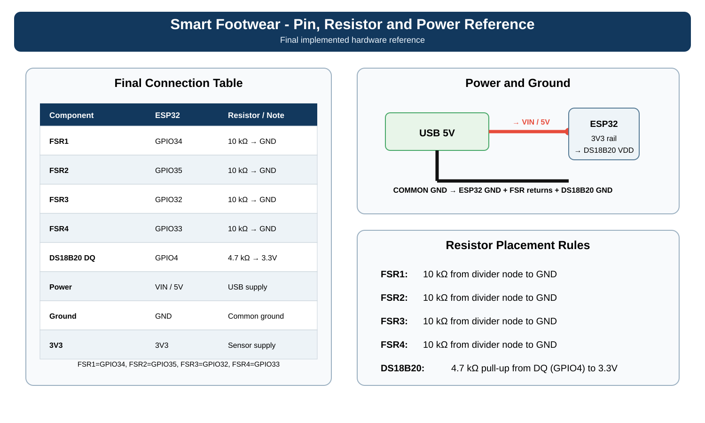

# Circuit Reference

## Final ESP32 Connections

| ESP32 GPIO | Connection |
|---|---|
| GPIO34 | FSR1 |
| GPIO35 | FSR2 |
| GPIO32 | FSR3 |
| GPIO33 | FSR4 |
| GPIO4 | DS18B20 DATA |

### Resistors

- FSR1: 10 kΩ resistor from divider node to GND
- FSR2: 10 kΩ resistor from divider node to GND
- FSR3: 10 kΩ resistor from divider node to GND
- FSR4: 10 kΩ resistor from divider node to GND
- DS18B20: 4.7 kΩ pull-up resistor between DATA (GPIO4) and 3.3V

### Power

- ESP32 VIN: 5V from USB/regulating supply
- ESP32 3V3: supply for the DS18B20
- ESP32 GND: common ground for all sensor circuits

## Circuit Diagrams

### 1. Circuit Overview



### 2. Detailed Wiring



### 3. Pin, Resistor and Power Reference



## FSR Voltage Divider

Each FSR is connected as a voltage divider:

```text
3.3V
  |
 FSR
  |
  +------> ESP32 ADC
  |
 10 kΩ
  |
 GND
```

## DS18B20 OneWire

```text
3.3V
  |
  4.7 kΩ
  |
  +------> DS18B20 DATA / ESP32 GPIO4
  |
DS18B20

DS18B20 VDD  -> 3.3V
DS18B20 GND  -> GND
```

These diagrams correspond to the final implemented pin configuration in the current firmware.
